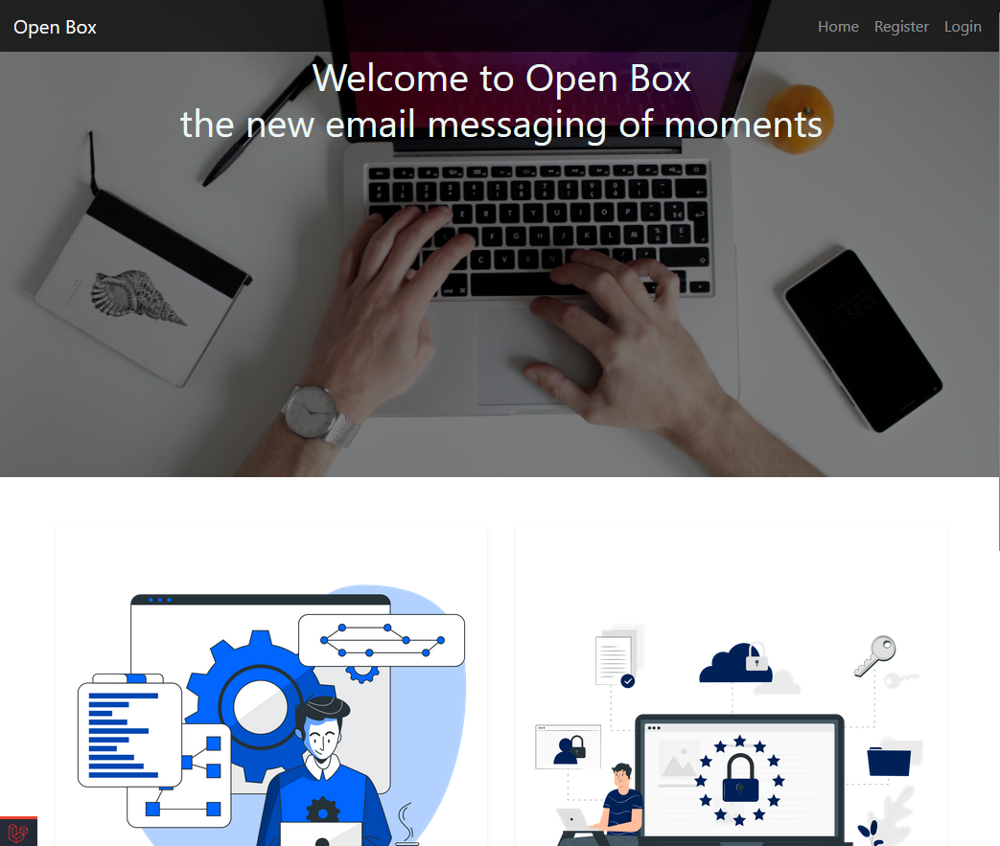
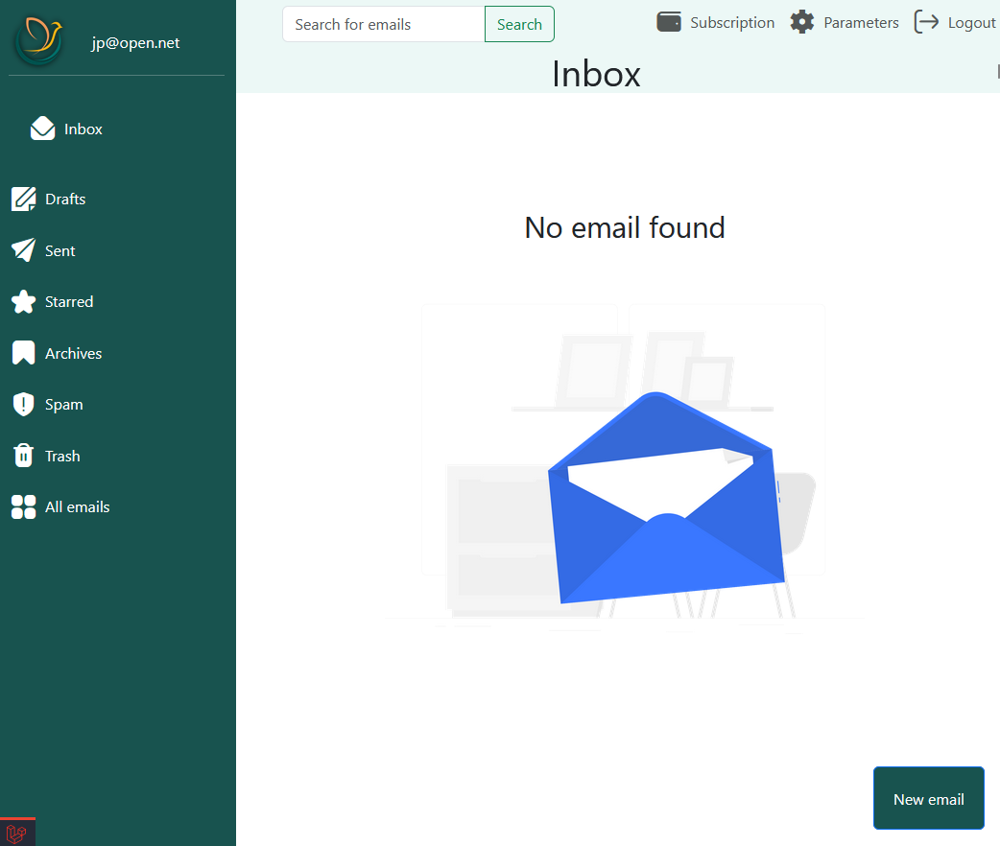
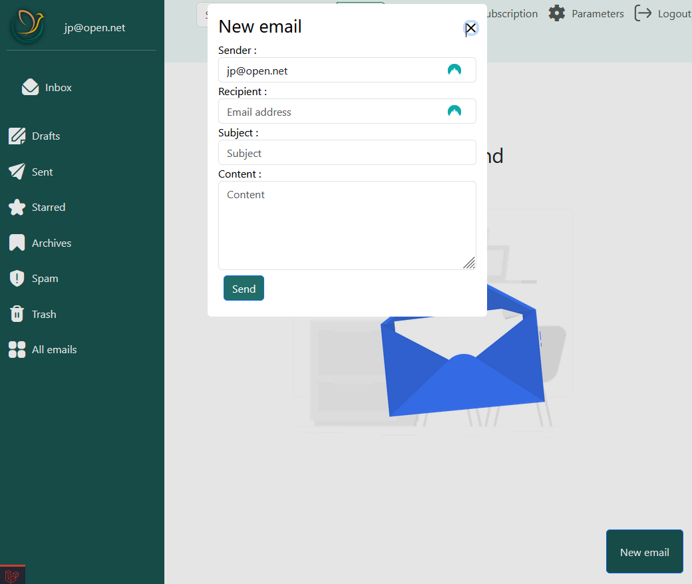
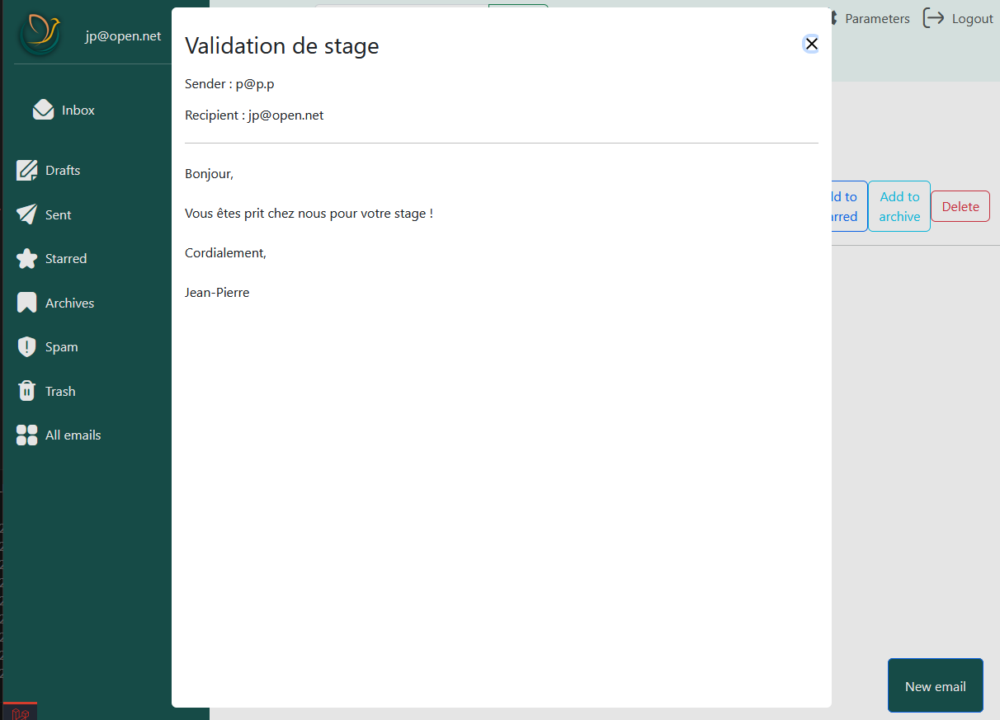

# Open Box

Open Box est une application web qui permet de gérer les boîtes mails tout en étant personnalisable qui offre des avantages dans une utilisation personnel et professionnel.

## Installation du projet :
Clone le projet
```bash
git init
git clone https://github.com/adanlaldy/open_box
```

### Installation PostgreSQL :
- installer postgres avec le lien : https://www.postgresql.org/download/
- configurer le '.env' avec les informations de la base de données
- dans le php.ini, décommenter la ligne 
  - 'extension=pdo_pgsql'
  - 'extension=pgsql'


### Installation des dépendances :
```bash
composer install
```

### Lancer le serveur :
```bash
php artisan serve
```


### Fonctionnalités majeures :
Open Box est une messagerie d’email qui a pour but de pouvoir permettre à l’utilisateur d’envoyer des emails à une personne existante dans la base de donnée. Cela inclut :


- Un système d’envoi d’email en local
- Un système de tri via des catégories
- Une barre de recherche afin de rechercher un email
- Une interface responsive (adaptable à la taille de l’écran et également sur mobile et tablette)
- Une personnalisation des langues, du thème ainsi que des informations utilisateurs
- Un système de récupération de mot de passe
- Un rôle administrateur qui offre des possibilités de gestion des utilisateurs

### Axes d’améliorations :


- Ajouter la possibilité de rajouter des pièces jointes dans un email
- Programmer un envoi d’email
- Répondre directement à un email + avoir un fil de discussion
- Transférer un email 
- Mettre en copie et copie anonyme un email
- Utiliser un serveur de messagerie afin d’utiliser les méthodes des classes Mailable intégrées à Laravel
- Créer des catégories personnalisées


### Architecture du site :

page d'accueil :
<p align="center">
  
</p>

page de réception :
<p align="center">
  
</p>

créer un nouvel email :
<p align="center">
  
</p>

visualisation d'un e-mail :
<p align="center">
  
</p>
    
FAURÉ Léo
LALDY-MAQUIHA Adan

