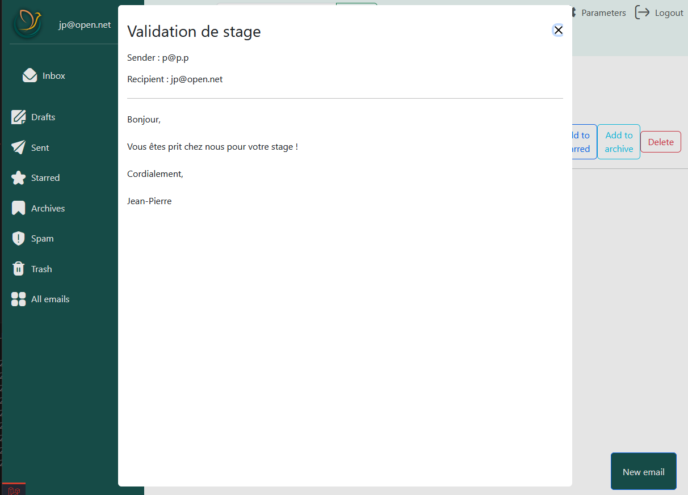

# Open Box

Open Box est une application web Laravel 100% responsive qui permet de gérer les boîtes mails tout en étant personnalisable et qui offre des avantages dans une utilisation personnelle et professionnelle.

### Architecture du site :

page d'accueil :
<p align="center">
  
</p>

page de réception :
<p align="center">
  
</p>

créer un nouvel email :
<p align="center">
  
</p>

visualisation d'un e-mail :
<p align="center">
  
</p>

## Comment utiliser Open Box ? :
Pour utiliser ce projet de messagerie d'email en local, vous aurez besoin d'avoir PHP installé sur votre machine. Veuillez vous renseigner sur la [documentation PHP officielle](https://www.php.net/manual/fr/install.php).

Ensuite, vous devrez installer Composer qui vous permettra de télécharger les dépendances nécessaires pour le fonctionnement du projet, renseignez-vous sur la [documentation Composer officielle](https://getcomposer.org/download/).


Cloner le projet avec Git :
```bash
git init
git clone https://github.com/adanlaldy/open_box
```

Vous devrez également avoir installé le logiciel de base de donnée PostgreSQL
- installer postgres avec le lien : https://www.postgresql.org/download/
- configurer le '.env' avec les informations de la base de données
- dans le php.ini, décommenter la ligne 
  - 'extension=pdo_pgsql'
  - 'extension=pgsql'


Une fois cela fait, il suffit de vous rendre à la racine du projet puis d'entrer la commande :

```bash
composer install
```
Cela installera toutes les dépendances nécessaires à votre projet Laravel. Ensuite, pour initialiser les tables de la base de donnée, entrez la commande :

```bash
php artisan migrate
```

Il ne vous reste plus qu'à lancer le serveur local avec la commande : 

```bash
php artisan serve
```

Cela vous affichera une adresse dans votre terminal. Vous n'aurez plus qu'à naviguer dessus, vous créer un compte, puis vous pourrez utiliser Open Box.

### Fonctionnalités majeures :
Open Box est une messagerie d’email qui a pour but de pouvoir permettre à l’utilisateur d’envoyer des emails à une personne existante dans la base de donnée. Cela inclut :


- Un système d’envoi d’email en local
- Un système de tri via des catégories
- Une barre de recherche afin de rechercher un email
- Une interface responsive (adaptable à la taille de l’écran et également sur mobile et tablette)
- Une personnalisation des langues, du thème ainsi que des informations utilisateurs
- Un système de récupération de mot de passe
- Un rôle administrateur qui offre des possibilités de gestion des utilisateurs

### Axes d’améliorations :


- Ajouter la possibilité de rajouter des pièces jointes dans un email
- Programmer un envoi d’email
- Répondre directement à un email + avoir un fil de discussion
- Transférer un email 
- Mettre en copie et copie anonyme un email
- Utiliser un serveur de messagerie afin d’utiliser les méthodes des classes Mailable intégrées à Laravel
- Créer des catégories personnalisées
    
FAURÉ Léo

LALDY-MAQUIHA Adan

